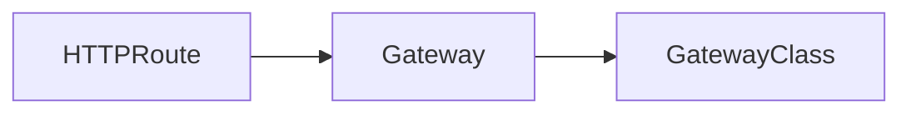

# Accès externe au cluster (PROD ready)

## Gateway

Nous allons exposer publiquement la dernière application que nous avons créé en utilisant la [Gateway API](https://kubernetes.io/docs/concepts/services-networking/gateway/)



Dans un cluster GKE (managé) les `GatewayClass` sont prédéfinies, vous utiliserez `gke-l7-global-external-managed`.

Créer une `Gateway` dans votre namespace à partir de cette `GatewayClass` pour définir où doit arriver le trafic.

```yaml
apiVersion: gateway.networking.k8s.io/v1
kind: Gateway
metadata:
  name: gw-<prenom>
  labels:
    demo: gateway
spec:
  gatewayClassName: gke-l7-global-external-managed
  listeners:
  - name: http
    protocol: HTTP
    port: 80
    hostname: "*.<prenom>.forma.kiowy.net"
    allowedRoutes:
      namespaces:
        from: Same
```

On a ici une `Gateway` qui écoute le trafic sur le port `80` arrivant avec les hosts en `*.<prenom>.forma.kiowy.net` pour les routes de votre namespace.

```bash
kubectl get gateway -o wide
```

Ajoutez la route HTTP pour dériger le traffic entrant pour `wp.<prenom>.forma.kiowy.net` vers votre service.

```yaml
apiVersion: gateway.networking.k8s.io/v1
kind: HTTPRoute
metadata:
  name: wordpress
  labels:
    demo: gateway
spec:
  parentRefs:
  - name: gw-<prenom>
  hostnames:
  - "wp.<prenom>.forma.kiowy.net"
  rules:
  - matches:
    - path:
        type: PathPrefix
        value: /
    backendRefs:
    - name: <nom-service>
      port: 80
```

Acceder à votre WordPress ! 

> [!tip]
> Ajouter à votre `/etc/hosts` la ligne suivante pour résoudre localement le hostname `wp.<prenom>.forma.kiowy.net`.
> ```bash
> <IP Gateway>  wp.<prenom>.forma.kiowy.net
> ```

---

## Ingress

> [!warn]
> [Documentation](https://kubernetes.io/docs/concepts/services-networking/ingress/) **Deprecated**
> The Kubernetes project recommends using Gateway instead of Ingress. The Ingress API has been frozen.
> This means that:
>
> * The Ingress API is generally available, and is subject to the stability guarantees for generally available APIs.
> * The Kubernetes project has no plans to remove Ingress from Kubernetes. 
> * The Ingress API is no longer being developed, and will have no further changes or updates made to it.
>

```yaml
apiVersion: networking.k8s.io/v1
kind: Ingress
metadata:
  name: guestbook
spec:
  rules:
  - host: guestbook.forma.kiowy.net
    http:
      paths:
      - path: /
        pathType: Prefix
        backend:
          service:
            name: frontend
            port:
              number: 80
```